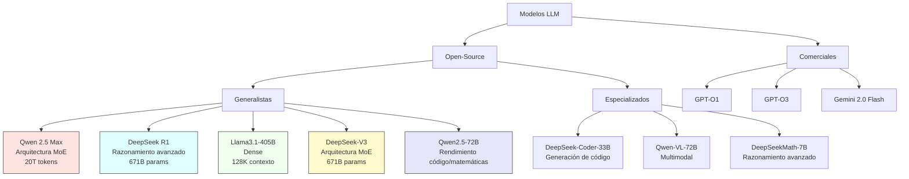

## **Wiki: Desarrollo de Asistentes con LLMs**  (Actualizada: 10 de Diciembre 2024)
*(Guía práctica para aprendizaje y desarrollo con modelos de lenguaje)*  

---

## **📚 Fundamentos Conceptuales**  
*Base teórica esencial para entender el ecosistema LLM*

### 1. **Arquitecturas Clave**  
- **Transformers**: Mecanismos de atención y tokenización (BPE vs WordPiece)  
- **Tipos de Modelos**:  
  - *Encoder-only* (BERT, RoBERTa) - Para comprensión  
  - *Decoder-only* (GPT, LLaMA) - Para generación  
  - *Encoder-Decoder* (T5, BART) - Para transformación  

### 2. **Tecnologías Centrales**  
- **Prompt Engineering**:  
  - Técnicas: Chain-of-Thought, Few-Shot Learning  
  - Herramientas: LangChain, Semantic Kernel  
- **RAG (Retrieval-Augmented Generation)**:  
  - Implementación con ChromaDB/FAISS  
  - Optimización de embeddings con SentenceTransformers  

---

## **🛠 Recursos Técnicos**  
*Herramientas y documentación para desarrollo práctico*

### **OpenAI Ecosystem**  
| Recurso | Descripción | Enlace |  
|---------|-------------|--------|  
| API Oficial | Documentación Open AI | [Documentación](https://platform.openai.com/docs) |  
| OpenAI Python | Biblioteca oficial | [openai-python GitHub](https://github.com/openai/openai-python) |  
| Cookbook | Ejemplos prácticos | [Open AI CookBook](https://github.com/openai/openai-cookbook) |  

### **Python para LLMs**  
- **Bases**:  
  - [Curso Automate the Boring Stuff](https://automatetheboringstuff.com/) (Fundamentos)  
  - [AsyncIO Docs](https://docs.python.org/3/library/asyncio.html) (Para APIs asíncronas)  
- **Librerías Esenciales**:  
  - Transformers (HuggingFace)  
  - LlamaIndex (Para RAG)  
  - Pydantic (Validación de datos)  

---

## **Modelos Open-Source y Comerciales**  
*Comparativa técnica de modelos gratuitos y comerciales*

### **Árbol Comparativo de Modelos LLM** [^](#comparative-tree)
Principales arquitecturas y sus características (2025):

### **Tabla Comparativa Detallada** [^](#detailed-table)
| Modelo | Arquitectura | Parámetros | Fortalezas | Licencia | Casos de Uso |
|--------|--------------|------------|------------|----------|--------------|
| **Qwen 2.5 Max** | MoE | 20T tokens | Multimodal, líder en MMLU-Pro y LiveCodeBench | Apache 2.0 | Desarrollo software, RAG |
| **DeepSeek R1** | Dense | 671B | Razonamiento avanzado, líder en GPQA-Diamond | Apache 2.0 | Investigación, análisis complejo |
| **GPT-O1** | Híbrida | - | Optimizado para tareas específicas | Comercial | Aplicaciones globales |
| **GPT-O3** | Híbrida | - | Mejor rendimiento en tareas generales | Comercial | Asistentes conversacionales |
| **Gemini 2.0 Flash** | Dense | - | Multimodal, rápido y eficiente | Comercial | Análisis de datos, generación de contenido |
| **DeepSeek-V3** | MoE | 671B | Eficiencia en recursos, líder en MMLU (89.1%)  | Apache 2.0 | Educación, análisis financiero |
| **Qwen2.5-72B** | Dense | 72B | SOTA en código (HumanEval 85+)  | Apache 2.0 | Desarrollo software, RAG |
| **Llama3.1-405B** | Dense | 405B | Mayor modelo open-source  | Meta License | Investigación, prototipado |
| **DeepSeek-Coder** | MoE | 33B | Soporte 16K tokens en código  | Apache 2.0 | DevOps, IDE inteligentes |

Nota: Todas las licencias Apache 2.0 y Meta License está disponibles para uso público.

---

### **Recursos Legales**  
- [Model License Database](https://huggingface.co/spaces/mlaw-ai/llm-license-checker)   

---

### **Proyectos y Repositorios**  
- **GitHub Pages**: Publicación de webs en GitHub  
  [GitHub Pages Repo](https://github.com/skills/github-pages)  
- **Crawl4AI**: Rastreos web con IA  
  [Crawl4AI Repo](https://github.com/unclecode/crawl4ai)  
- **Agent Embed**: Integración de agentes conversacionales  
  [Agent Embed Repo](https://github.com/Predictable-Dialogs/agent-embed)  
- **Open Assistant GPT**: Asistentes conversacionales en cloud  
  [Open Assistant GPT Repo](https://github.com/OpenAssistantGPT/OpenAssistantGPT)  

---
